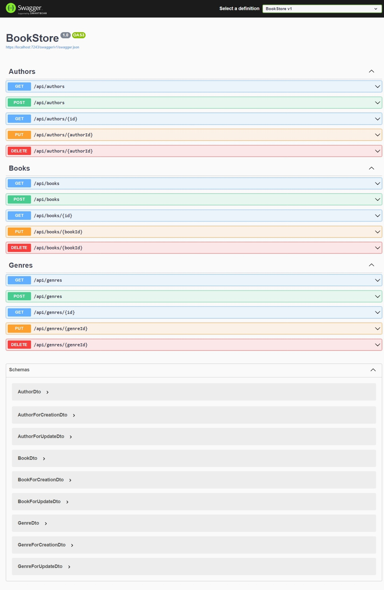

# Bookstore API

This is backend API for a bookstore. It is built with ASP.NET Core ,Entity Framework 
and SQL Server Database.

## Table of Contents
	
1. [Setup and Run](#setup-run)
2. [Database Setup and Sample data](#database-setup-sample-data)
3. [Running the server](#running-the-server)
4. [List of API endpoints](#api-endpoints)

## Setup and Run

1. **Clone the Repository**
https://github.com/Bhawna-Bhatt/C-Capstone-BookStore.git

2. Change into the project directory:
 cd C-Capstone-BookStore

3.Run the following command to restore the project dependencies
dotnet restore

4. Build the project to ensure everything is set up correctly:
dotnet build

5.Start the Web API by running:
dotnet run

By default, this will start the API on http://localhost:portNumber or https://localhost:portNumber. 
Check the output of the dotnet run command for the exact URLs.

## Database Setup and Sample data

1. Ensure that SQL Server instance is running.

2. Run the below commands in Package Manager to create database

add-migrations add InitialCreate
update-database

## Running the server

Run the following command -
dotnet-run

## List of API endpoints
		
Books:
GET /books : Retrieve a list of all books
GET /books/{book_id} : Retrieve details of a specific book 
POST /books : Add a new book
PUT /books/{book_id} : Update details of an existing book 
DELETE /books/{book_id} : Delete a specific book 

Authors:
GET /authors : Retrieve a list of all authors
GET /authors/{author_id} : Retrieve details of a specific author 
POST /authors : Add a new author
PUT /authors/{author_id} : Update details of an existing author 
DELETE /authors/{author_id} : Delete a specific author

Genres:
GET /genres : Retrieve a list of all genres
GET /genres/{genre_id} : Retrieve details of a specific genre 
POST /genres : Add a new genre

